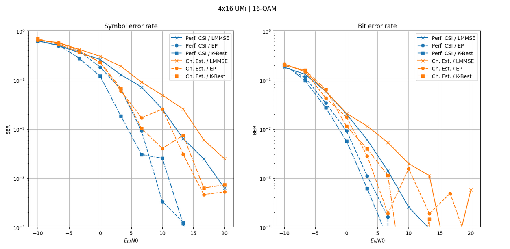
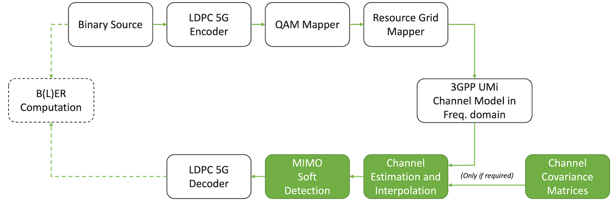

# OFDM MIMO Channel Estimation and Detection with Sionna (5G)
## 1. Mục tiêu
Dự án này tập trung nghiên cứu và mô phỏng bài toán ước lượng kênh (Channel Estimation) và phát hiện tín hiệu (MIMO Detection) trong hệ thống OFDM-MIMO theo chuẩn 5G NR, sử dụng framework Sionna của NVIDIA dựa trên TensorFlow.
Các mục tiêu chính của dự án bao gồm:

Xây dựng mô hình end-to-end OFDM-MIMO từ phía phát đến phía thu theo chuẩn 5G

Nghiên cứu và so sánh các phương pháp ước lượng kênh OFDM, bao gồm:
- Least Squares (LS)
- Nội suy Nearest-Neighbor
- Nội suy Linear
- Nội suy LMMSE (có/không làm mượt không gian – thời gian – tần số)

Đánh giá độ chính xác ước lượng kênh thông qua chỉ số MSE (Mean Square Error) theo SNR

So sánh các thuật toán MIMO Detection phổ biến trong Sionna:

- LMMSE (Linear Detection)
- K-Best Detection
- Expectation Propagation (EP)
- MMSE-PIC

Phân tích ảnh hưởng của:
- Perfect CSI vs Imperfect CSI (Channel Estimation)
- SNR (Eb/N0)
- Số anten MIMO 

Đánh giá hiệu năng hệ thống thông qua:
- SER (Symbol Error Rate: Tỷ lệ lỗi ký hiệu): một chỉ số đo lường chất lượng truyền dẫn không dây. SER thể hiện số lượng ký hiệu (symbol) bị lỗi nhận được trên tổng số ký hiệu truyền đi.

- BER (Bit Error Rate): tỷ lệ giữa số bit lỗi và tổng số bit được truyền đi.

Dự án hướng tới mục tiêu benchmark các bộ thu OFDM-MIMO trong điều kiện thực tế, đồng thời làm nền tảng cho các nghiên cứu nâng cao như learned receivers hoặc model-driven deep learning trong 5G/6G.

## 2. Cài đặt
Phần này hướng dẫn chi tiết cách cài đặt môi trường để chạy mô phỏng OFDM MIMO Channel Estimation and Detection bằng framework Sionna.

### 2.1. Yêu cầu hệ thống

### 2.1.1. Phần cứng (khuyến nghị)

CPU: Intel/AMD 64-bit

RAM: ≥ 8 GB (khuyến nghị ≥ 16 GB)

GPU: NVIDIA GPU hỗ trợ CUDA (tùy chọn, nhưng giúp tăng tốc mô phỏng)

Dung lượng trống: ≥ 10 GB

### 2.1.2. Phần mềm

Hệ điều hành:
- Ubuntu 20.04 / 22.04 / 24.04 (khuyến nghị)

Python:

- Phiên bản Python 3.10 – 3.12

Trình soạn thảo / môi trường phát triển:

- VS Code, PyCharm hoặc Jupyter Notebook

### 2.2. Cài đặt Python và môi trường ảo

Khuyến nghị sử dụng virtual environment để tránh xung đột thư viện.

### 2.2.1. Cài đặt Python (nếu chưa có)

```
sudo apt update
sudo apt install python3 python3-pip python3-venv -y
```
Kiểm tra phiên bản:
```
python3 --version
```
### 2.2.2. Tạo và kích hoạt môi trường ảo

```
python3 -m venv venv
source venv/bin/activate
```
Sau khi kích hoạt thành công, terminal sẽ hiển thị tiền tố (venv).

### 2.3. Cài đặt các thư viện cần thiết
### 2.3.1. Cập nhật pip
```
pip install --upgrade pip
```
### 2.3.2. Cài đặt Sionna và các thư viện phụ thuộc
```
pip install sionna tensorflow numpy scipy matplotlib
```

Các phiên bản thư viện đã được sử dụng trong dự án trên Ubuntu 22.04:

---
| Thư viện       | Phiên bản |
| -------------- | --------- |
| **Sionna**     | 1.2.0     |
| **TensorFlow** | 2.10.1    |
| **NumPy**      | 1.26.4    |
| **SciPy**      | 1.11.4    |
| **Matplotlib** | 3.8.2     |

---

### 2.4. Cài đặt và sử dụng Jupyter Notebook (nếu dùng)
```
pip install jupyterlab
```

Truy cập Jupyter Notebook trong môi trường ảo:
```
jupyter lab
```

### 3. Cách chạy code

Phần này hướng dẫn chi tiết cách khởi chạy và thực thi mô phỏng OFDM MIMO Channel Estimation and Detection bằng Jupyter Notebook.

### 3.1. Kích hoạt môi trường ảo
Trước khi chạy Jupyter Notebook, cần kích hoạt môi trường ảo.
```
source venv/bin/activate
```
### 3.2. Khởi động Jupyter Notebook / JupyterLab

Từ thư mục gốc của dự án, chạy:
```
jupyter lab
```

Hoặc (nếu dùng Jupyter Notebook cổ điển):
```
jupyter notebook
```
### 3.3. Mở và cấu trúc Notebook
Trong giao diện Jupyter:

1. Điều hướng tới thư mục chứa project
2. Mở file notebook chính: tutorials/phy/OFDM_MIMO_Detection.ipynb

⚠️ Lưu ý: Notebook cần được mở trong môi trường venv, nếu không có thể xảy ra lỗi thiếu thư viện

### 3.4 Chạy code
### 3.4.1. Chạy toàn bộ Notebook

Chọn Run → Run All Cells

Hoặc dùng phím tắt:
```
Shift + Enter
```
### 3.4.2. Thứ tự chạy khuyến nghị

Để tránh lỗi, cần chạy notebook theo đúng thứ tự:
1. Import thư viện (TensorFlow, Sionna, NumPy, …)
2. Khai báo tham số hệ thống (SNR, số antenna, modulation)
3. Xây dựng mô hình OFDM MIMO
4. Thực hiện mô phỏng
5. Hiển thị và lưu kết quả (BER/SER, biểu đồ)

### 3.5. Thời gian chạy và tài nguyên
Thời gian mô phỏng phụ thuộc vào:
- Số iteration
- Batch size
- Số antenna (MIMO order)
- Mức SNR khảo sát

### 4. Kết quả

Phần này trình bày các kết quả chính thu được từ quá trình mô phỏng hệ thống OFDM MIMO Channel Estimation and Detection sử dụng framework Sionna, đồng thời đưa ra những nhận xét tổng quan về hiệu năng hệ thống.

Toàn bộ kết quả được thực hiện dựa trên notebook:
```
tutorials/phy/OFDM_MIMO_Detection.ipynb
```


Notebook này xây dựng mô hình mô phỏng end-to-end cho hệ thống OFDM-MIMO, từ phát sinh dữ liệu, điều chế, truyền qua kênh 3GPP UMi, ước lượng kênh, phát hiện tín hiệu cho đến đánh giá hiệu năng thông qua các chỉ số MSE, SER và BER.

### 4.1. Các chỉ số đánh giá

Trong dự án, hiệu năng hệ thống được đánh giá thông qua các chỉ số sau:
- BER (Bit Error Rate): Tỷ lệ lỗi bit sau khi giải mã, phản ánh trực tiếp chất lượng truyền dẫn của hệ thống.
- SER (Symbol Error Rate) : Tỷ lệ lỗi ký hiệu trước khi giải mã kênh.
- SNR (Signal-to-Noise Ratio): Tham số chính để khảo sát hiệu năng hệ thống trong các điều kiện kênh khác nhau.

### 4.2. Kết quả mô phỏng BER theo SNR
Kịch bản mô phỏng: mô phỏng thể hiện hiệu năng của hệ thống OFDM MIMO
4×16, điều chế 16-QAM, trong môi trường 3GPP UMi, với các thuật toán detection khác
nhau: LMMSE, EP, K-Best

Hai trường hợp CSI được xét: Perfect CSI, Channel Estimation (Imperfect CSI)

Hai chỉ số đánh giá: SER (Symbol Error Rate), BER (Bit Error Rate)



Kết quả mô phỏng cho thấy:
- BER giảm rõ rệt khi SNR tăng, phù hợp với lý thuyết truyền thông số
- Ở vùng SNR thấp, nhiễu chiếm ưu thế làm BER cao
- Khi SNR đủ lớn, hệ thống đạt vùng error floor thấp, cho thấy khả năng phát hiện và giải mã hiệu quả

Biểu đồ BER–SNR thể hiện rõ xu hướng này và được sử dụng để so sánh các cấu hình hệ thống khác nhau.

### 4.3. Ảnh hưởng của số lượng antenna (MIMO order)

Kết quả mô phỏng chỉ ra rằng:
- Khi số antenna phát/thu tăng, hiệu năng hệ thống được cải thiện
- Hệ thống MIMO khai thác được đa dạng không gian (spatial diversity) và đa luồng (spatial multiplexing)
- Với cùng mức SNR, cấu hình MIMO bậc cao cho BER thấp hơn so với cấu hình ít antenna
Điều này chứng minh vai trò quan trọng của MIMO trong các hệ thống thông tin không dây hiện đại như LTE và 5G.

### 4.4. So sánh các phương pháp ước lượng và phát hiện

Tùy theo cấu hình mô phỏng, các phương pháp phát hiện tín hiệu được đánh giá cho thấy:
- Các phương pháp phi tuyến (ví dụ: MMSE-PIC, EP, K-Best) cho hiệu năng tốt hơn so với phương pháp tuyến tính trong điều kiện kênh phức tạp
- Khi CSI không hoàn hảo, hiệu năng giảm nhưng vẫn giữ được xu hướng BER–SNR ổn định
- Sionna cho phép mô phỏng linh hoạt cả trường hợp perfect CSI và imperfect CSI
Kết quả phản ánh sát các phân tích lý thuyết trong các tài liệu nghiên cứu về OFDM MIMO.

### 4.5. Tổng kết kết quả

Từ các kết quả mô phỏng, có thể rút ra các kết luận chính:
- Hệ thống OFDM MIMO cho hiệu năng vượt trội so với hệ thống SISO
- Hiệu năng truyền dẫn phụ thuộc mạnh vào SNR và số lượng antenna
- Framework Sionna cho phép xây dựng mô hình end-to-end linh hoạt, trực quan và sát thực tế
- Kết quả mô phỏng phù hợp với lý thuyết truyền thông số và các nghiên cứu liên quan

## License and Citation

Sionna is Apache-2.0 licensed, as found in the [LICENSE](https://github.com/nvlabs/sionna/blob/main/LICENSE) file.

If you use this software, please cite it as:
```bibtex
@software{sionna,
 title = {Sionna},
 author = {Hoydis, Jakob and Cammerer, Sebastian and {Ait Aoudia}, Fayçal and Nimier-David, Merlin and Maggi, Lorenzo and Marcus, Guillermo and Vem, Avinash and Keller, Alexander},
 note = {https://nvlabs.github.io/sionna/},
 year = {2022},
 version = {1.2.1}
}
```
